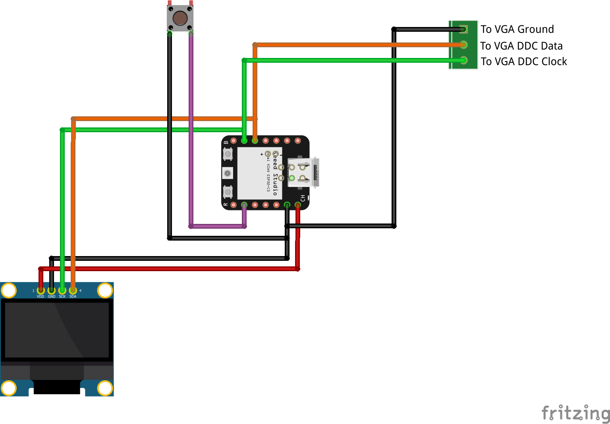
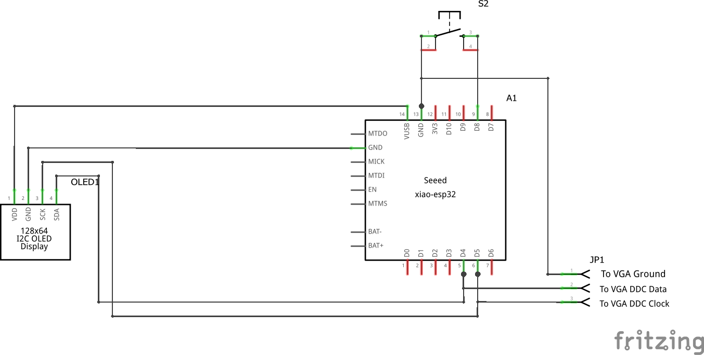

# ESP Monitor Control

## Hardware

- ESP32C3 XIAO by Seeed Studio
- OLED Display 128x64 SH1106 (I2C)

## Software

- Visual Studio Code with [extension for Arduino](https://marketplace.visualstudio.com/items?itemName=vsciot-vscode.vscode-arduino)

## Libraries

- Adafruit GFX Library - https://github.com/adafruit/Adafruit-GFX-Library
- Adafruit SH110x - https://github.com/adafruit/Adafruit_SH110x (Depends on your OLED display controller)

## Circuit diagram

Visual

Schematic

